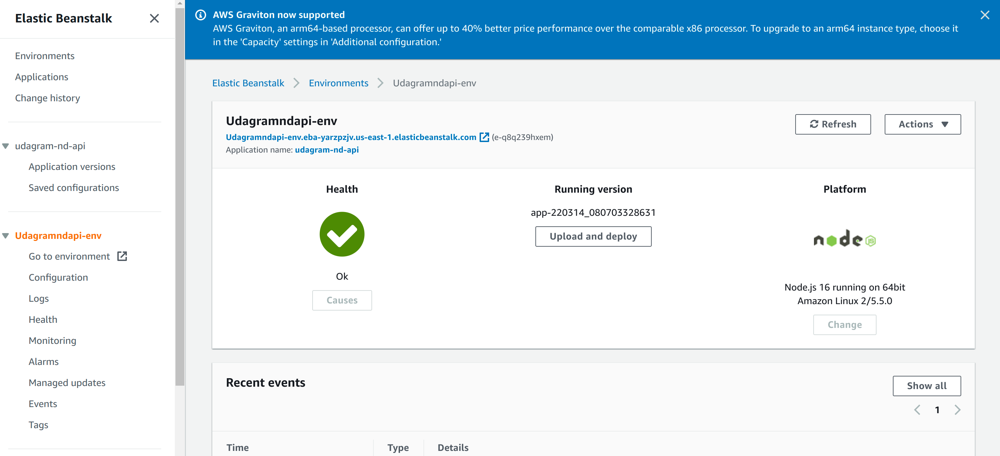
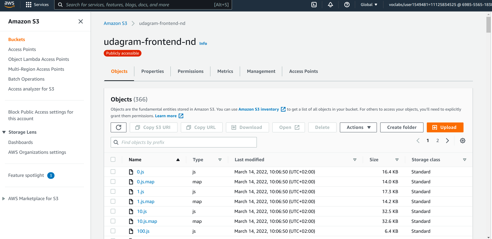
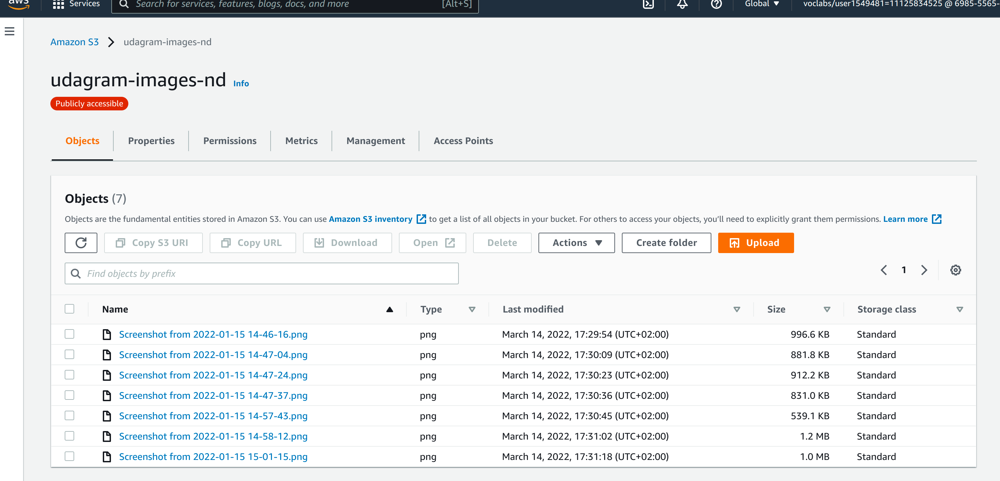
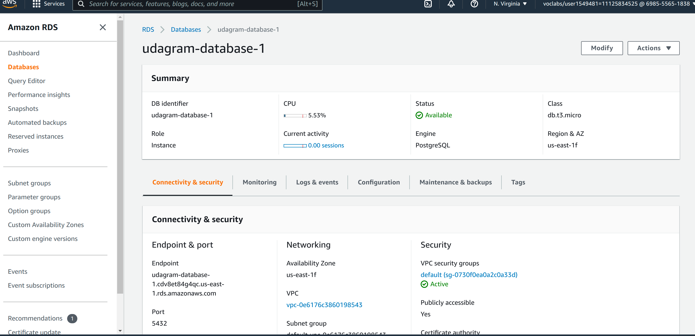
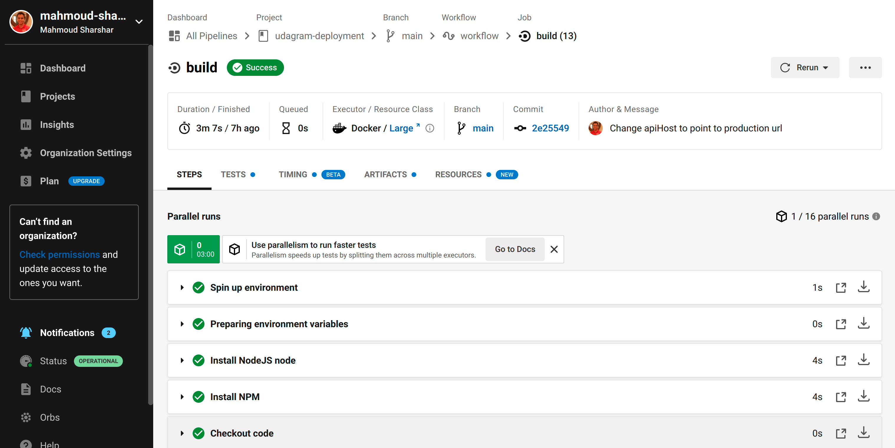
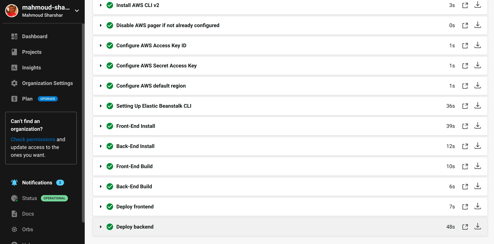
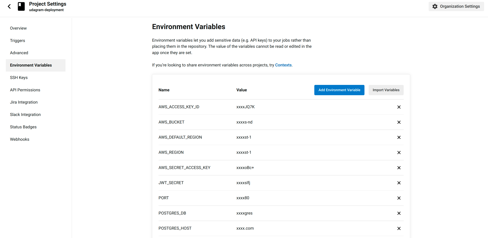
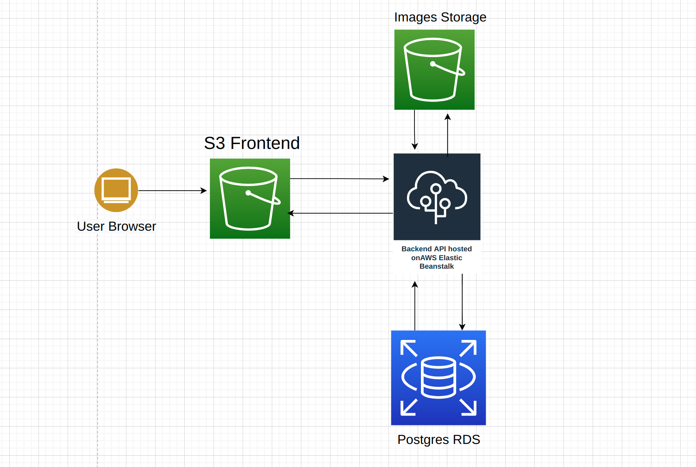

## Configuration Screenshots

### Elastic Beanstalk Environment

### FrontEnd S3 Bucket

### Media S3 Bucket

### PostgreSQL RDS database

### CircleCI Pipeline

#### Pipeline Schema

#### Env variables 

### Architecture

