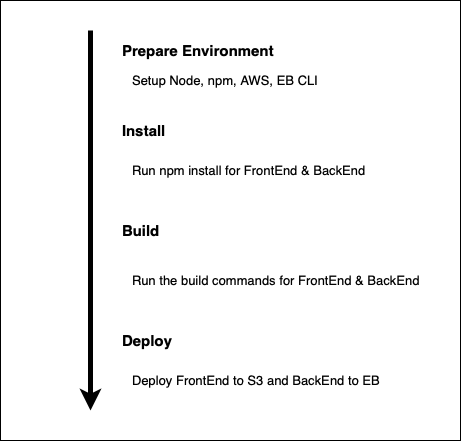

# Pipeline Process

The CircleCI pipeline is setup and connected to this GitHub repository where every change in it will trigger a build in CircleCI.

## Order of commands

1. The pipeline uses orbs to install Node, the AWS cli and the EB cli.
2. It checks out the code from the repo.
3. FrontEnd & BackEnd install
4. FrontEnd & BackEnd build
5. FrontEnd & BackEnd deploy

## Schema

